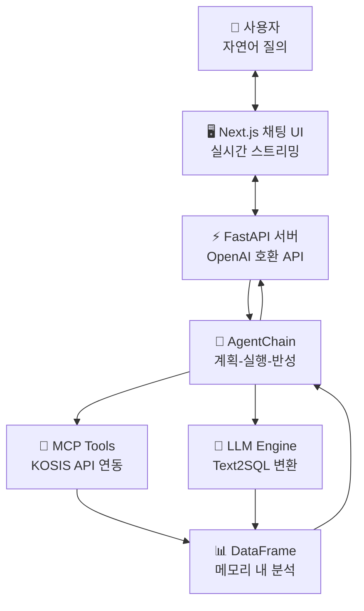

# Text2SQL Agent Platform 📊

> **자연어 질의를 DataFrame 분석으로 변환하는 AI 기반 공공데이터 분석 플랫폼**  
> KOSIS 공공데이터와 연동하여 실시간 통계 분석을 제공합니다.

## 🎯 프로젝트 개요

Text2SQL Agent는 **자연어 질의**를 **pandas DataFrame 분석**으로 변환하고, **KOSIS 공공데이터**를 자동으로 수집하여 실시간 분석 결과를 제공하는 AI 기반 플랫폼입니다.

### 🚀 핵심 기능

- **🤖 자연어 → DataFrame 쿼리 변환**: LLM 기반 pandas 코드 자동 생성
- **📊 공공데이터 자동 수집**: KOSIS API 연동으로 실시간 데이터 조회
- **🔄 실시간 스트리밍**: 분석 과정을 단계별로 실시간 표시
- **🧠 계획-실행-반성**: 오류 발생 시 자동 재계획 및 재실행
- **💬 채팅 UI**: ChatGPT 스타일의 직관적인 웹 인터페이스

### 🏗️ 시스템 아키텍처



## 📁 프로젝트 구조

```
text2sqlagent/
├── 🔧 backend/                     # Python 백엔드
│   ├── integrated_api_server.py    # FastAPI 메인 서버
│   ├── agent/                      # AI 에이전트 모듈
│   │   ├── agent_chain.py          # 계획-실행-반성 파이프라인
│   │   └── text2sql_agent.py       # DataFrame 쿼리 생성기
│   ├── llm_client/                 # LLM 추상화 레이어
│   │   ├── base.py                 # 공통 인터페이스
│   │   ├── openai_api.py           # OpenAI API 연동
│   │   ├── huggingface.py          # HuggingFace 연동
│   │   └── gguf.py                 # gguf 연동
│   ├── mcp_api.py                  # KOSIS 공공데이터 API
│   └── tests/                      # 테스트 스위트
└── 🎨 frontend/                    # React/Next.js 프론트엔드
    ├── src/components/chat/        # 채팅 UI 컴포넌트
    ├── src/hooks/                  # React 커스텀 훅
    ├── src/utils/api.ts            # API 클라이언트
    └── src/types/                  # TypeScript 타입 정의
```

## 🛠️ 설치 및 실행

### 전제 조건
- Python 3.8+ 
- Node.js 18+
- OpenAI API Key 또는 HuggingFace Token
- KOSIS API Key (선택사항)

### 1️⃣ 환경 설정

```bash
# 저장소 클론
git clone <repository-url>
cd text2sqlagent

# 환경 변수 설정 (.env 파일 생성)
OPENAI_API_KEY=your_openai_api_key
KOSIS_OPEN_API_KEY=your_kosis_api_key  # 선택사항
LLM_BACKEND=openai                     # openai, huggingface, gguf
OPENAI_MODEL=gpt-3.5-turbo
```

### 2️⃣ 백엔드 실행

```bash
cd backend

# 의존성 설치
pip install -r requirements.txt

# API 서버 시작
python integrated_api_server.py
```

서버가 실행되면 다음 주소에서 접근 가능:
- **API 서버**: http://localhost:8000
- **API 문서**: http://localhost:8000/docs
- **Health Check**: http://localhost:8000/health

### 3️⃣ 프론트엔드 실행

```bash
cd frontend

# 의존성 설치
npm install

# 개발 서버 시작
npm run dev
```

- **웹 UI**: http://localhost:3000

## 🎯 사용 방법

### 💬 질의 예시

```
🔍 인구 분석
"한국의 인구 통계를 보여주세요"
"서울시 인구 변화를 분석해주세요"

📈 경제 분석  
"2020년부터 2023년까지 GDP 성장률을 분석해줘"
"최근 5년간 물가상승률 추이를 보여주세요"

🏘️ 부동산 분석
"서울 아파트 평균 거래가격을 알려주세요"
"지역별 전세가격 비교 분석을 해주세요"
```

### 📱 웹 UI 사용

1. http://localhost:3000 접속
2. 자연어로 질의 입력
3. 실시간 분석 과정 확인
4. 결과 확인 및 다운로드

### 🔧 API 직접 사용

#### 일반 채팅 API
```bash
curl -X POST http://localhost:8000/v1/chat/completions \
  -H "Content-Type: application/json" \
  -d '{
    "model": "text2sql",
    "messages": [{"role": "user", "content": "한국의 인구 통계를 보여주세요"}]
  }'
```

#### 스트리밍 API
```bash
curl -X POST http://localhost:8000/v1/chat/stream \
  -H "Content-Type: application/json" \
  -d '{
    "model": "text2sql",
    "messages": [{"role": "user", "content": "한국의 인구 통계를 보여주세요"}]
  }'
```

## 🔄 실시간 스트리밍 기능

사용자가 질의를 보내면 다음과 같은 과정을 **실시간으로** 확인할 수 있습니다:

```
🚀 분석을 시작합니다...

📋 계획 수립
✅ 계획 수립 완료: 3개 단계
1. KOSIS에서 인구 통계 조회
2. 데이터 분석 및 요약
3. 결과 시각화

🔧 도구 실행 상태:
● fetch_kosis_data ✅ 완료

📊 데이터 쿼리 실행 중...

📈 분석 결과:
| 지역 | 인구수 | 증감률 |
|------|--------|--------|
| 서울 | 9,720,846 | -0.91% |
| 부산 | 3,349,016 | -1.64% |
```

## 🧪 테스트

### Backend 테스트
```bash
cd backend
python -m pytest tests/ -v
```

### Frontend 테스트
```bash
cd frontend
npm run test
npm run type-check
```

### End-to-End 테스트
```bash
# 통합 테스트 실행
cd backend
python tests/test_integration.py
```

## 🔧 개발 및 확장

### 새로운 LLM 백엔드 추가

`backend/llm_client/` 디렉터리에 새로운 클라이언트 추가:

```python
# backend/llm_client/new_llm.py
from .base import LLMClient

class NewLLMClient(LLMClient):
    def chat(self, messages, **kwargs):
        """새로운 LLM API 연동 구현"""
        pass
        
    def stream_chat(self, messages, **kwargs):
        """스트리밍 응답 구현"""
        pass
```

### 새로운 데이터 소스 추가

`backend/mcp_api.py`에 새로운 API 함수 추가:

```python
def fetch_new_data_source(api_key, **params):
    """새로운 데이터 소스 연동
    
    Args:
        api_key: API 키
        **params: API별 파라미터
        
    Returns:
        pandas.DataFrame: 수집된 데이터
    """
    # API 호출 및 DataFrame 반환
    pass
```

### Frontend 커스텀 컴포넌트 추가

```typescript
// src/components/custom/CustomAnalysis.tsx
interface CustomAnalysisProps {
  data: DataFrame;
  analysisType: string;
}

export default function CustomAnalysis({ data, analysisType }: CustomAnalysisProps) {
  // 커스텀 분석 컴포넌트 구현
  return (
    <div className="custom-analysis">
      {/* 분석 결과 표시 */}
    </div>
  );
}
```

## 📈 성능 및 확장성

### 성능 최적화 팁

1. **캐싱 활용**
   ```python
   # 자주 사용되는 KOSIS 데이터 캐싱
   @lru_cache(maxsize=100)
   def get_cached_kosis_data(stat_list, item_id):
       return fetch_kosis_data(stat_list, item_id)
   ```

2. **비동기 처리**
   ```python
   # 대용량 데이터 처리 시 비동기 사용
   async def process_large_dataset(df):
       # 청크 단위로 처리
       for chunk in pd.read_csv(file, chunksize=10000):
           await process_chunk(chunk)
   ```

3. **메모리 관리**
   ```python
   # DataFrame 메모리 사용량 최적화
   df = df.astype({'column': 'category'})  # 카테고리형으로 변환
   del large_df  # 불필요한 DataFrame 삭제
   ```

### 확장 계획

- **다중 언어 지원**: 영어, 중국어 등 다국어 질의 처리
- **추가 데이터 소스**: 한국은행, 국토교통부 등 API 연동
- **고급 시각화**: D3.js 기반 인터랙티브 차트
- **실시간 알림**: WebSocket 기반 데이터 변경 알림
- **사용자 관리**: 로그인, 권한 관리, 쿼리 히스토리

## 🚀 배포

### Docker 컨테이너 사용

```bash
# Docker 이미지 빌드
docker build -t text2sql-agent .

# 컨테이너 실행
docker run -p 8000:8000 -p 3000:3000 \
  -e OPENAI_API_KEY=your_key \
  text2sql-agent
```

### 프로덕션 배포

```bash
# 백엔드 프로덕션 실행
cd backend
gunicorn -w 4 -k uvicorn.workers.UvicornWorker integrated_api_server:app

# 프론트엔드 빌드 및 배포
cd frontend
npm run build
npm start
```

## 🤝 기여하기

1. Fork 프로젝트
2. Feature 브랜치 생성 (`git checkout -b feature/AmazingFeature`)
3. 변경사항 커밋 (`git commit -m 'Add some AmazingFeature'`)
4. 브랜치에 Push (`git push origin feature/AmazingFeature`)
5. Pull Request 생성

### 개발 가이드라인

- **코드 스타일**: Black (Python), Prettier (TypeScript) 사용
- **테스트**: 새로운 기능에 대한 테스트 코드 필수
- **문서화**: 함수/클래스에 대한 docstring 작성
- **타입 힌트**: Python, TypeScript 모두 타입 힌트 사용

## 📄 라이선스

이 프로젝트는 MIT 라이선스 하에 배포됩니다. 자세한 내용은 `LICENSE` 파일을 참조하세요.

## 🙏 참고 자료

- [Arctic-Text2SQL-R1](https://www.snowflake.com/en/engineering-blog/arctic-text2sql-r1-sql-generation-benchmark/) - RL 기반 Text2SQL SOTA 모델
- [KOSIS OpenAPI](https://kosis.kr/openapi) - 통계청 공공데이터 API
- [FastAPI](https://fastapi.tiangolo.com/) - 고성능 Python 웹 프레임워크
- [Next.js](https://nextjs.org/) - React 기반 풀스택 프레임워크
- [pandas](https://pandas.pydata.org/) - 데이터 분석 라이브러리

## 📞 지원 및 문의

- **이슈 신고**: [GitHub Issues](https://github.com/your-username/text2sqlagent/issues)
- **기능 요청**: [GitHub Discussions](https://github.com/your-username/text2sqlagent/discussions)
- **개발 현황**: `PROJECT_STATUS.md` 파일 참조

---

<div align="center">
  <b>🚀 Text2SQL Agent로 공공데이터를 더 쉽게, 더 스마트하게! 🚀</b>
</div> 